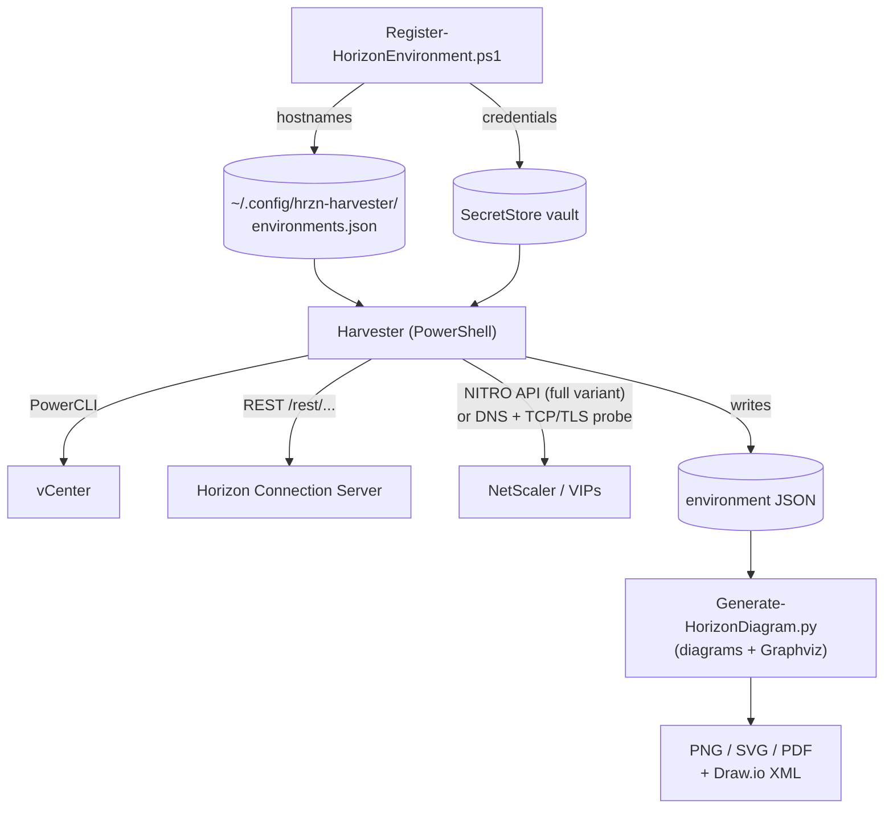

# hrzn-view-diagram

**Automated VMware Horizon View architecture diagram generator.**
Scans your environment via PowerCLI, the Horizon REST API, and the NetScaler
NITRO API — then renders a layered, professional architecture diagram as PNG,
SVG, or an editable Draw.io file.

> Built by James Cruce · [ASTGL - As The Geek Learns](https://astgl.com)

---

## Project Structure

```
hrzn-view-diagram/
├── harvester/
│   ├── Invoke-HorizonHarvester.ps1              # Full scan (with NetScaler)
│   ├── Invoke-HorizonHarvester-NoNetScaler.ps1  # DNS+port-probe inference variant
│   ├── Register-HorizonEnvironment.ps1          # One-time environment + credential setup
│   ├── Test-HorizonLogin.ps1                    # Diagnostic for Horizon REST login failures
│   └── Common/HorizonEnvConfig.psm1             # Shared config + SecretStore helpers
├── generator/
│   └── Generate-HorizonDiagram.py               # Diagram renderer
├── config/
│   └── environments.example.json                # Schema for the multi-environment config
├── sample-data/
│   └── sample-environment.json                  # Test data — no live env needed
├── docs/diagrams/                               # Architecture diagram of this tool
├── data/                                        # Harvested JSON per environment (gitignored)
├── output/                                      # Generated diagrams (gitignored)
├── requirements.txt
└── README.md
```

---

## Quick Start

### 1 — Install Python dependencies

```bash
# macOS (Homebrew Graphviz required)
brew install graphviz
pip install -r requirements.txt
```

### 2 — Install PowerCLI (Windows / PowerShell 7)

```powershell
Install-Module -Name VMware.PowerCLI -Scope CurrentUser -AllowClobber
Set-PowerCLIConfiguration -InvalidCertificateAction Ignore -Confirm:$false
```

### 3 — Run the Harvester

**With NetScaler credentials:**
```powershell
.\harvester\Invoke-HorizonHarvester.ps1 `
    -vCenterServer vcenter.example.org `
    -HorizonServer horizon-cs01.example.org `
    -NetScalerServer netscaler-mgmt.example.org `
    -OutputPath .\horizon-environment.json
```

**Without NetScaler credentials (uses DNS + TCP probing):**
```powershell
.\harvester\Invoke-HorizonHarvester-NoNetScaler.ps1 `
    -vCenterServer vcenter.example.org `
    -HorizonServer horizon-cs01.example.org `
    -HorizonExternalURL vdi.example.org `
    -OutputPath .\horizon-environment.json
```

### 4 — Generate the Diagram

```bash
# PNG + editable Draw.io file
python generator/Generate-HorizonDiagram.py \
    --input horizon-environment.json \
    --format png \
    --drawio

# SVG (vector — best for documentation)
python generator/Generate-HorizonDiagram.py \
    --input horizon-environment.json \
    --format svg

# Clean version without port labels (exec presentations)
python generator/Generate-HorizonDiagram.py \
    --input horizon-environment.json \
    --no-port-labels

# Test with sample data (no live environment needed)
python generator/Generate-HorizonDiagram.py \
    --input sample-data/sample-environment.json \
    --drawio
```

---

## Multi-Environment Workflow

If you manage Horizon across multiple environments (prod, test, DR…), you can
register each one **once** and never retype hostnames or credentials again.
Hostnames live in a shared JSON config; credentials live in an encrypted
SecretStore vault.

### 1 — Register an environment (one-time)

```powershell
pwsh ./harvester/Register-HorizonEnvironment.ps1 -Environment prod
```

This will:
- Install `Microsoft.PowerShell.SecretManagement` + `SecretStore` (first run only)
- Prompt for a SecretStore **master password** (first run only — remember it!)
- Prompt for vCenter FQDN, Horizon CS FQDN, external URL, and TLS skip preference
- Prompt for vCenter and Horizon credentials
- Write hostnames to `~/.config/hrzn-harvester/environments.json`
- Store credentials as `hrzn-prod-vcenter` and `hrzn-prod-horizon` in the vault

Add `-Variant full` to also prompt for NetScaler NITRO credentials. Note that only
`Invoke-HorizonHarvester-NoNetScaler.ps1` reads `-Environment` today; the full harvester still
takes `-vCenterServer`, `-HorizonServer` and `-NetScalerServer` directly.

`Register-HorizonEnvironment.ps1` and `Test-HorizonLogin.ps1` require PowerShell 7.

### 2 — Harvest

```powershell
pwsh ./harvester/Invoke-HorizonHarvester-NoNetScaler.ps1 -Environment prod
```

Output goes to `data/prod-environment.json`.

### 3 — Generate

```bash
python generator/Generate-HorizonDiagram.py --environment prod --drawio
```

Reads `data/prod-environment.json`, writes `output/prod-diagram.{png,drawio}`.

### Security Note — why SecretStore and not `Export-Clixml`?

> `Export-Clixml` with a `PSCredential` is a well-known PowerShell pattern on
> Windows: DPAPI encrypts the file so only the current user on the current
> machine can read it. On **macOS and Linux** PowerShell 7 has no DPAPI
> equivalent — it falls back to storing the AES key **next to** the
> ciphertext. That's obfuscation, not encryption: anyone who can read the
> file can decrypt it.
>
> `Microsoft.PowerShell.SecretStore` is Microsoft's supported cross-platform
> answer: real AES-256 encryption gated by a user-supplied master password,
> identical behaviour on Windows, macOS, and Linux. You'll be asked for the
> master password once per shell session (15-minute timeout by default).

### Config file location

```
~/.config/hrzn-harvester/environments.json   # default
$env:HRZN_CONFIG_PATH                         # override via env var
--config-path <file>                          # override via CLI (Python generator)
```

A template with the expected schema lives at `config/environments.example.json`.

---

## Diagram Layers

| Layer | Components |
|-------|-----------|
| Clients / Internet | Thin clients, browsers, Horizon Client |
| DMZ | NetScaler VIPs, UAGs (Unified Access Gateways) |
| Horizon Internal | Connection Servers, Composer, App Volumes, Desktop Pools |
| vSphere Platform | vCenter, Distributed Virtual Switches |
| Compute | vSphere Clusters (optionally with individual ESXi hosts) |
| Storage | FC Switches (Fabric A/B), All-Flash Arrays, Datastores |

---

## NetScaler Variants

| Variant | NetScaler Data | Method |
|---------|---------------|--------|
| `Invoke-HorizonHarvester.ps1` | Full — VIPs, LB method, persistence, cipher suites, HA pair | NITRO REST API |
| `Invoke-HorizonHarvester-NoNetScaler.ps1` | Inferred — VIP FQDN/IP, open ports, SSL cert | DNS + TCP probe + TLS handshake |

**What's missing without NetScaler credentials:**
- Load balancing algorithm (round-robin, least-connections, etc.)
- Persistence type (source IP, cookie, etc.)
- TLS cipher suites and policy names
- SSL offload vs. passthrough configuration
- Content switching policies
- Health monitor configuration
- HA pair nodes (primary/secondary appliances)
- Appliance model and firmware version

**What's inferred without credentials:**
- VIP FQDN (from Horizon Connection Server `external_url` property)
- VIP IP address (DNS resolution)
- Open ports (TCP `Test-NetConnection` probe)
- SSL certificate subject, issuer, SAN, and expiry date

---

## Generator Options

```
--environment, -E NAME  Resolve input/output from the environments config
--config-path FILE      environments.json to use (default $HRZN_CONFIG_PATH or ~/.config/hrzn-harvester/)
--input, -i FILE        Harvester JSON (default data/NAME-environment.json with --environment,
                        otherwise horizon-environment.json)
--output, -o STEM       Output filename stem (no extension)
--output-dir, -O DIR    Output directory (default: output)
--format, -f FORMAT     png | svg | pdf  (default: png)
--drawio              Also generate a Draw.io editable XML file
--show-hosts          Show individual ESXi hosts inside cluster boxes
--no-port-labels      Hide port/protocol labels on edges (cleaner for presentations)
--summary-only        Print environment summary without generating diagram
```

---

## Troubleshooting Horizon login

If the harvester gets a 401 from Horizon, `harvester/Test-HorizonLogin.ps1 -HorizonServer <fqdn> -Username <user>`
tries several domain/username formats against `/rest/login` and prints each response. It does not
read the vault or the config file.

---

## Architecture



A rendered diagram is in [`docs/diagrams/horizon-view-diagram.architecture.svg`](docs/diagrams/horizon-view-diagram.architecture.svg)
(source: `docs/diagrams/horizon-view-diagram.architecture.json`).

---

## Scheduling as a Living Document

```powershell
# Weekly automated re-harvest (Sunday 2AM) — keeps diagram current
$action = New-ScheduledTaskAction `
    -Execute "pwsh.exe" `
    -Argument "-NonInteractive -File $PWD\harvester\Invoke-HorizonHarvester-NoNetScaler.ps1 ..."

$trigger = New-ScheduledTaskTrigger -Weekly -DaysOfWeek Sunday -At 2am

Register-ScheduledTask -TaskName "Horizon Diagram Harvester" `
    -Action $action -Trigger $trigger -RunLevel Highest
```

---

## Environment

- **PowerShell**: 7+ in practice. The harvesters declare `#Requires -Version 5.1`, but they use the `?.` null-conditional operator, which only parses on PowerShell 7+. `Register-HorizonEnvironment.ps1` and `Test-HorizonLogin.ps1` require 7+ explicitly.
- **VMware PowerCLI**: 13.0+
- **Horizon**: 7.8+ (REST API required)
- **Python**: 3.8+
- **Graphviz**: System binary required (see Quick Start)

---

## License

MIT — use freely, attribution appreciated.
